#ShardingSphere-分布式数据库解决方案生态圈

开始一个思考：每天产生大量订单，订单表一直在累计越来越大,同时存在订单生成和订单修改查询的并发请求，同时存在很多非订单业务关联订单表查询等？

##数据库本质
>程序 = 输入 -> 输出 = 业务逻辑 + 数据存储   
CPU -> Application   
Disk -> Database   
Memory -> Cache   

##MYSQL诞生和发展
###MYSQL历史

1970 年，IBM 公司的研究员 E.F.Codd 在题为《大型共享数据库数据的关系模型》的论文中
提出了数据库的关系模型   ORACLE、DB2、SQLSERVER等问世。  
2000 年以后，随着互联网的飞速发展，开 源免费的 MySQL 数据库以及其高效 MyISAM 引擎、2006 年发布的 InnoDB 引擎逐步赢得
人们的青睐，成为最流行的数据库和引擎。   
2010 年后 MySQL 与 Sun 被 Oracle 收购,积累了大量的 MySQL 技术经验和数据库相关研究者,Oracle重而贵,开始去 IOE化。   
###互联网时代出现的问题和解决方案  

数据量的增大，读写并发的增加，系统可用性要求的提升   
1.高吞吐-容量不足难以扩容
2.读写压力-QPS过大读写压力，分析需求影响业务需求   
3.高可用-网络和宕机问题   

1.首先面对读写压力可以部署多机集群和主从复制,根据sql写路由到写库，读路由到读库,这样压力就小了   
2.可用性提升配置多个从库实现主从切换,可用性提升，宕机问题   
3.吞吐量提升数据库拆分,一个数据承载能力是有限的拆分后原有请求散落到各个分库上容量自然就增加了   
引入的问题：
1.读写分离后存在写的事务完成，从库还没binlog,读到的数据不准违背事务
2.同微服务治理,如何保证数据中心集群健康运行和主节点选取
3.跨库SQL,一致性问题，分布式事务

##应对互联网海量数据
###应对过程
1.垂直拆分 -> 多个提供不同业务数据处理能力的数据库,多个表通过主业务id关联成1个大表  (业务解耦 -> SOA - 微服务 - 中台)

问题:原来一个复杂 SQL 直接把一批这批相关的信息都查了出来，现在这个SQL不能用了，得改写SQL和程序
业务系统有较强的侵入性，改造和管理复杂容易出故障

2.水平拆分 -> 数据进行分片,不改变数据本身的结构,基于中间件做到透明

3.数据本身的读写压力较大，磁盘 IO 已经成为瓶颈，分库比分表要好,磁盘压力被分摊直，集群的并行数据处理能力提升。相反计算密集单次查询耗时，分表减少单表操作时间同磁盘单库多连接并行能力提升

###问题本质
引入分布式系统 增大容量,提高可用  
1.CAP定理   
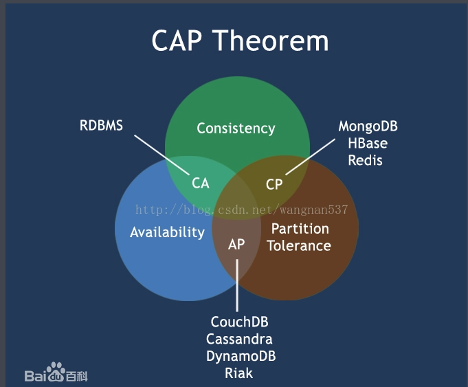   
2.Paxos协议   
Process-提案节点，提出某个值进行设置操作，成功就不会丢失不可变   
Acceptor-决策节点，提案一旦过半就被比准，被批准,值不能在更改，不会丢失，最终所有节点都会接受   
Learner-记录节点，不参与提案和批准，从另2类系欸但学习已经达成共识的提案，例如从网络分区中恢复

Paxos的版本有: Basic Paxos , Multi Paxos, Fast-Paxos, Raft 和ZAB等
Raft 落地框架 Consul TiDB
ZAB 落地 Zookeeper
分布式系统参考资料：https://www.jianshu.com/p/98c29c6fbd85

###解决思路
1.MYSQL主从配置 MYSQL本身支持    
>手动切换主从,大量繁琐配置
 
2.MySQL Group Replication高可用 
>基于分布式 Paxos 协议实现组复制，高容错性内置防脑裂，高扩展性自动从其他时间节点同步增量数
据，直到与其他数据一致，提供单主模式和多主模式，单主模式在主库宕机后能够自动选主，所有写入都在主节点进行，
多主模式支持多节点写入   外部使用LVS/VIP配置, 外部获得状态变更需要读取数据库

MySQL Cluster = MySQL Group Replication + MySQL Route + Mysql Shell
>MySQL团队方案
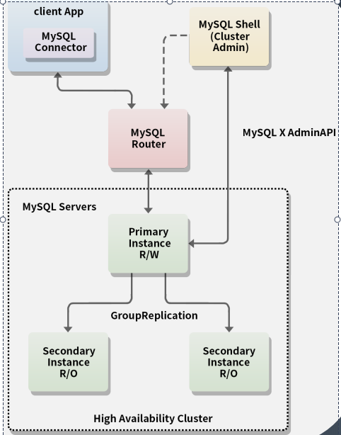

总结解决方案选型   
1.框架类库 -> TDDL Apache ShardingSphere-JDBC   
2.中间件 -> ShardingSphere-Proxy MyCat  => DataBase Mesh   
3.分布式数据库 -> GaussDB、TIDB  

##ShardingSphere是什么？
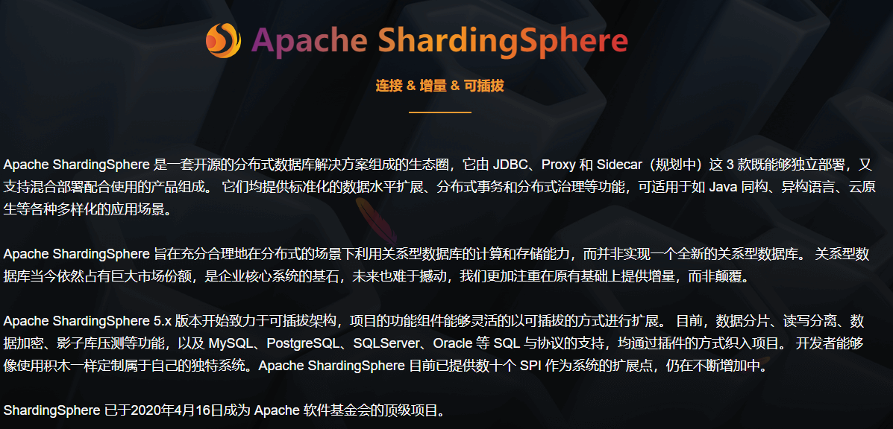
##ShardingSphere解决示例 以一个例子开始探索ShardingSphere
>订单表share_order => order_id,user_id,order_name,order_time 每天产生大量订单，订单表超大查询性能不佳，同时例如用户关联顶单表等信息拖慢其他业务运行，同时并发请求也上不去被阻塞在磁盘IO

1.拆分订单表,把订单表拆成多张表,索引B+树高度表低，单表查询效率变高，解决第一个痛点 （todo:是否需要把用户的订单分到一张表上避免重复查询多张表） 按用户id分表   
2.磁盘io的问题还是没解决数据库整体压力还是大,那么进行拆库提高磁盘IO增加QPS,由于关联用户，如果按用户操作会产生跨库JOIN和分布式事务，按用户id分库，那么分表策略改为按订单id取模
以ShardingSphere-JDBC为例开始演示：
>1.引入ShardingSphere-JDBC依赖
 
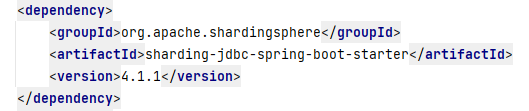
>2.配置数据源和分库分表策略

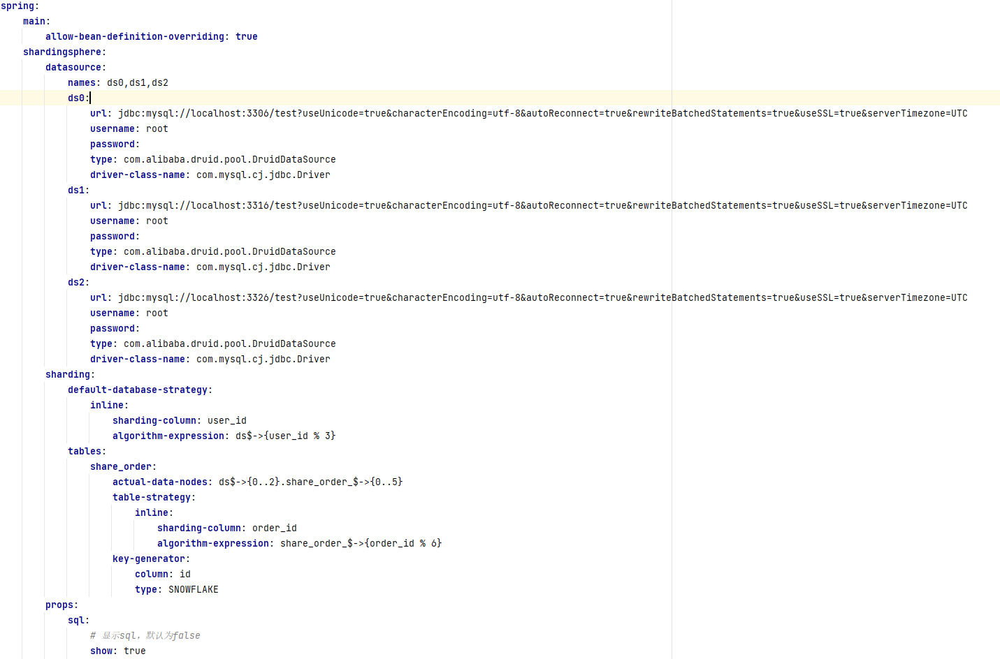

>3.编写SQL查看执行效果
> 
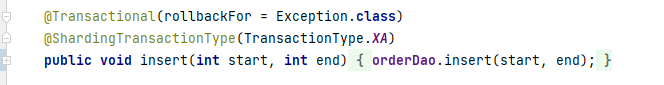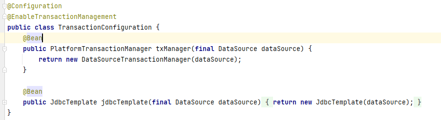
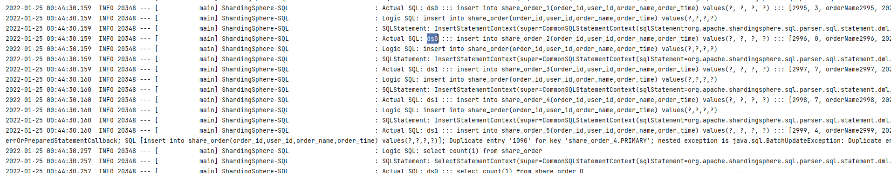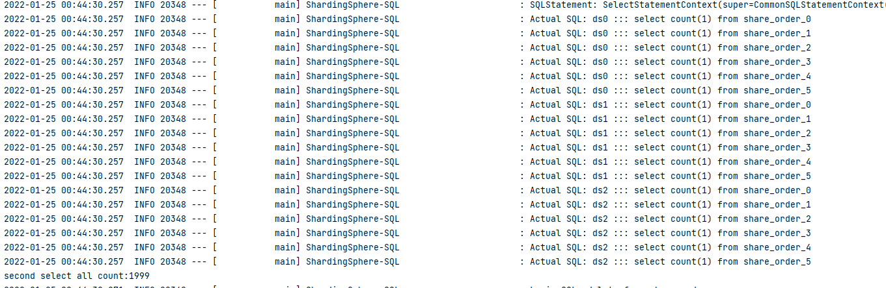

## ShardingSphere流程分析
###核心诉求
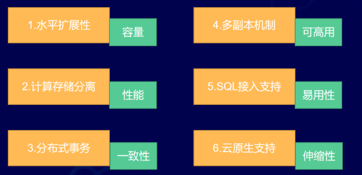
>>容量：体现在线性的水平扩展性上   
>>性能：计算、存储分离   
>>一致性：分布式事务   
>>高可用：基于 paxos 或 raft 的多副本机制   
>>易用性：支持某种 SQL 协议接入   
>>伸缩性：支持云原生，比如通过 k8s 之类的容器调度，增加或减少节点   
 
>1.核心执行流程

Standard 内核流程由 SQL 解析 => SQL 路由 => SQL 改写 => SQL 执行 => 结果归并
Federation 执行引擎流程由 SQL 解析 => 逻辑优化 => 物理优化 => 优化执行 => Standard 内核流程
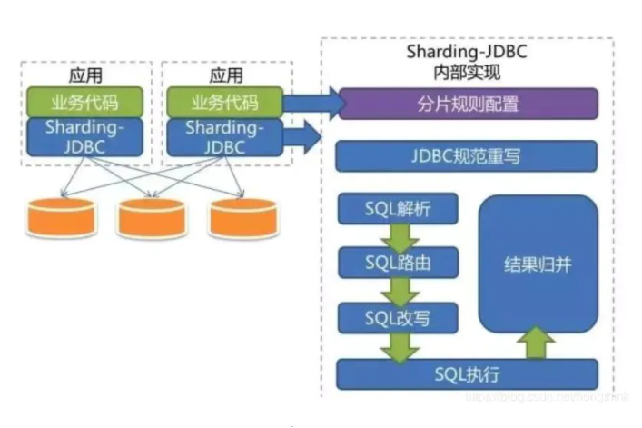

>2.一致性

xa: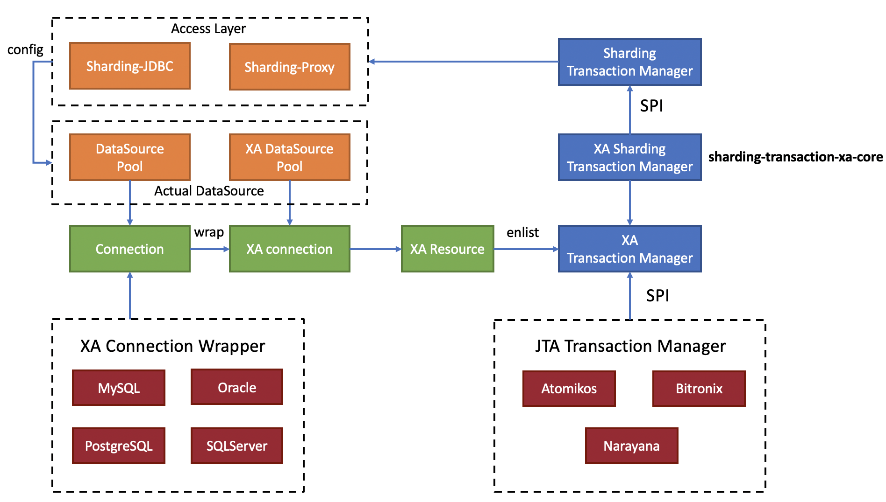
seata: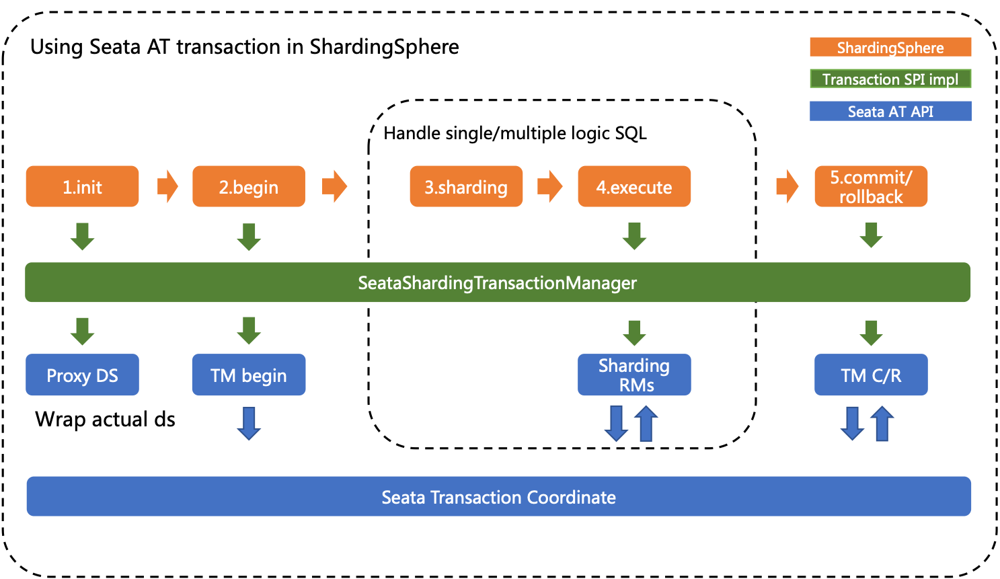

>3.弹性伸缩

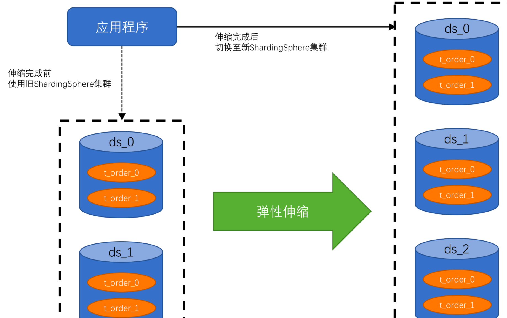 

###以中间件方式运行ShardingSphere Proxy看看效果
>1.部署shardingSphere Proxy docker或者手动运行jar

手动运行:   
下载 ShardingSphere-Proxy 的最新发行版。
解压缩后修改 conf/server.yaml 和以 config- 前缀开头的文件，如：conf/config-xxx.yaml 文件，进行分片规则、读写分离规则配置。配置方式请参考配置手册。   
Linux 操作系统请运行 bin/start.sh，Windows 操作系统请运行 bin/start.bat 启动 ShardingSphere-Proxy。如需配置启动端口、配置文件位置，可参考快速入门。   

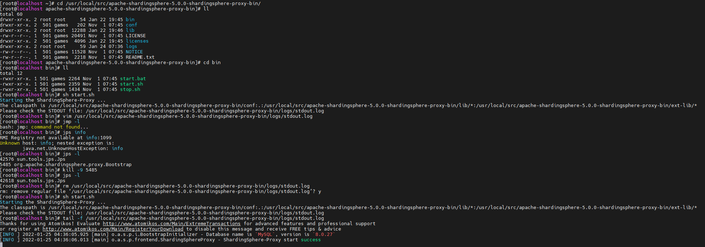
运行成功

>查看数据库状态
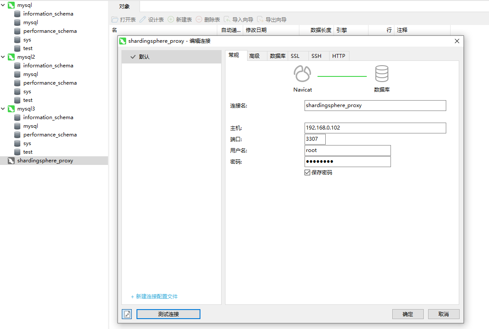

>执行SQL

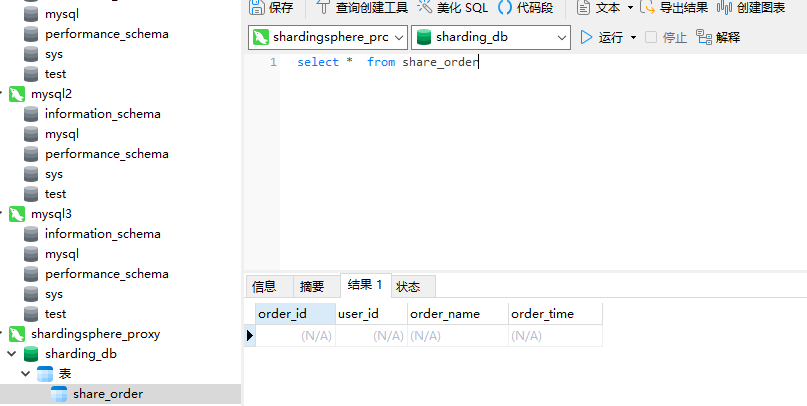
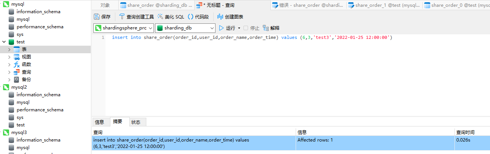
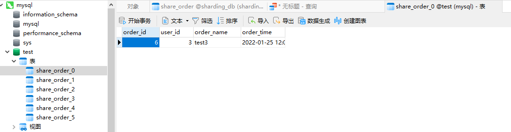

ShardingSphere-JDBC优点：   
1、轻量，只是JDBC增强兼容JDBC和各种ORM框架   
2、开发的工作量较小，不关注 nio，数据库协议等,支持任意实现JDBC规范的数据库   
3、性能高，JDBC 直连数据库  
缺点：   
1.同构语言强关联JAVA   
2.入侵业务代码需要在代码配置规则和编写SQL   
3.数据迁移重新分库分表难   
4.不适用OLAP 数据按不同维度的聚合，维度的上钻，下卷等   

Proxy 版的优点：   
1、可以负责更多的内容，将数据迁移，分布式事务等纳入 Proxy 的范畴   
2、更有效的管理数据库的连接     
3、整合大数据思路，将 OLTP联机事务处理 和 OLAP联机分析处理 进行分离处理   

官方文档
https://shardingsphere.apache.org/document/current/cn/reference/sharding/

## ShardingSphere发展方向和前景  
step1： MySQL 数据库集成 继承MySQL其不断发展的强大功能   
step2：JDBC框架,在业务系统在封装 JDBC 接口从而增强 MySQL   
step3: proxy对业务系统透明，可以在各种不同语言平台下使用，业务无侵入,可搭配业务场景使用OLAP OLTP
step4: scaling 动态扩容，自动迁移,稳定运维 平滑升级    
step5: database-mesh 数据库网格，业务只专注业务屏蔽配置和管理，对接云原生service mesh    
step6: engine平台，系统的模块化，实现可插拔平台，强大引擎编排实现贴和自己的最小中间件、分布式数据库

### ShardingSphere-Sidecar  Kubernetes的云原生数据库代理 
就是所谓的Database Mesh 数据网格比分布式数据库更值得期待！

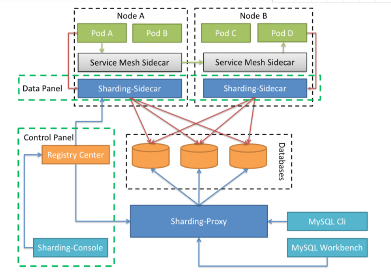
###谈谈Sidecar
https://docs.microsoft.com/en-us/azure/architecture/patterns/

Deploy components of an application into a separate process or container to provide isolation and encapsulation. - Sidecar

业务服务只需要专注实现业务逻辑即可。如上图那样，应用服务你只管开好你的车，边车上的可以遛狗可以大仗演讲啥都可以，分布式控制和逻辑解耦

##参靠资料：   
《千亿数据的潘多拉魔盒：从分库分表到分布式数据库》 --秦金卫(kimmking)   
《CAP百度百科、Azure官网、ShardingSphere社区等》